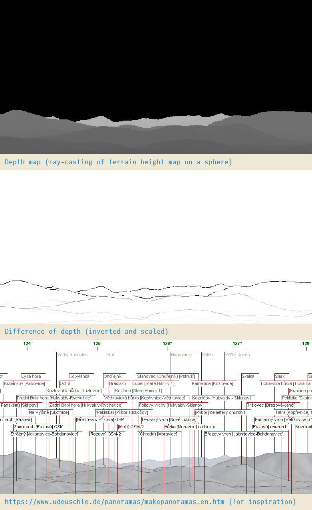

# What's this

First ever Julia code attempt :-)

As of 2021-08-28 it's for personal use as it contains many hard-coded variables (heightmap path, view set to Praděd,CZ)

## Historical background

Original code for panorama rendering was written in Python and unfinished/unpolished.
I've found https://www.udeuschle.de/panoramas/makepanoramas_en.htm that was by far superior.
Program in Python run in order of tens of minutes (2.6GHz Core2Duo) and manual measuring of angle (encoded in x position) and distance (encoded in color) to find far away hills on the map was not convenient. It was enough to confirm that High Tatras are visible from Praděd and if Schneeberg is visible from few places around Brno. Nothing else.

But because I found Julia language accidentally (by finding JuliaMono font) and it stated that it's way faster than Python, I tried it and after three evenings extended it beyond original functionality. Hopefully program runs in order of seconds on historic i5-4590@3.3GHz using three cores.

Honestly, for every other Python script I wrote speed does not matter.

## TODOs

* [x] Automatic anotations (summits from database, azimuths, horizon line)
* [x] Change annotation rendering from Luxor to Cairo (it's more useful to learn)
* [x] Render annoations to the same image
* [ ] WIP: Summit database for Slovakia and Alps, some manual entries for local hills
* [x] Make it work over any azimuth range (e.g. 350° to 10°, 170° to -170°)
* [ ] WIP: Optimizations (wgs84->sphere), remove atan
* [ ] Explore where WGS84 vs Sphere matters (cause annotation are few pixels off)
* [ ] WIP: Object oriented code (how classes work in Julia?)
* [ ] Coloring (and shading?), legend (color->distance)
* [ ] Input data interpolation
* [ ] Test for western/southern hemisphere? I don't need it.
* [ ] Sky, haze, clouds, athmospheric light scattering, stars, sun, texturing (just kidding)

## Sample output

```
Requesting data for area 47°N 15°E - 50°N 21°E ... (aprox. 530x444 km).
I will read 7x4=28 tiles, heightmap size is 8401x4801 (81 MB).
Loading tile 002/028 lat=47, lon=19
Loading tile 001/028 lat=47, lon=17
Loading tile 024/028 lat=50, lon=20
  ⋮ 
Loading tile 025/028 lat=50, lon=16
Loading tile 026/028 lat=50, lon=18
Earth radius is 6367.1 km (diffraction x1.18)
Output size is 7855 x 901 pixels
Output resolution is 0.100000 mrad per pixel or 174.532925 pixels per degree
HILL TEST CODE ---- 
           Lysá hora is possibly visible at azimuth 123.8, distance 106.0 km
                Smrk is possibly visible at azimuth 127.5, distance 104.0 km
             Kněhyně is possibly visible at azimuth 129.5, distance 101.6 km
              Travný is possibly visible at azimuth 121.8, distance 108.6 km
              Skalka is possibly visible at azimuth 127.0, distance  97.0 km
      Velký Javorník is possibly visible at azimuth 132.4, distance  91.1 km
  ⋮         
min=0 max=2376
Saving distmap-gray.png
Saving horizon.png
```

## Images and comparison



## Data sources

Heightmaps:

POIs:
